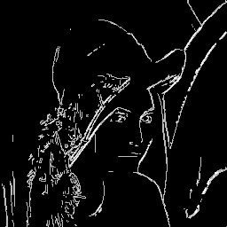

# rust-simplecv
Make computer vision in Rust simpler!



## Introduction
`simplecv`, as its name said, is a **simple** computer vision crate implemented in Rust. It is still in active development.

## Usage 
Put following line into your `Cargo.toml`.
```
simplecv = "*"
```
Check [docs.rs](https://docs.rs/simplecv) for documentation of APIs!

## Highlights
1. Simple interface: based on [ndarray](https://github.com/rust-ndarray/ndarray), all functions in `simplecv` are easy to use for developers who are familar with MATLAB or numpy + OpenCV.
2. Simple values: all data are in `f64` type. Users does not need to care the problem lead by performing operations on u8 data.
3. Simple dependency: use as few extern crates as possible so that it is simple to install and intergrate.

## Example: Edge Detection

Simply four lines code to obtain the cover image (edge detection result) with Canny's edge detector!
```Rust
let lenna = imread("lenna.png");                        // read file
let lenna = rgb2gray(&lenna);                           // to gray
let edge = canny_edge(&lenna, 
           0.5, 0.05, BorderType:: Reflect);            // REAL WORK!
imsave_gray(&edge, "canny.png");                        // save image
```


## License
This project is licensed by a BSD 3-caluse. See LICENSE for details. 

